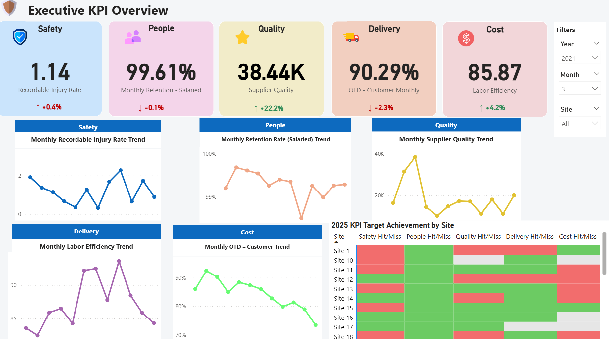
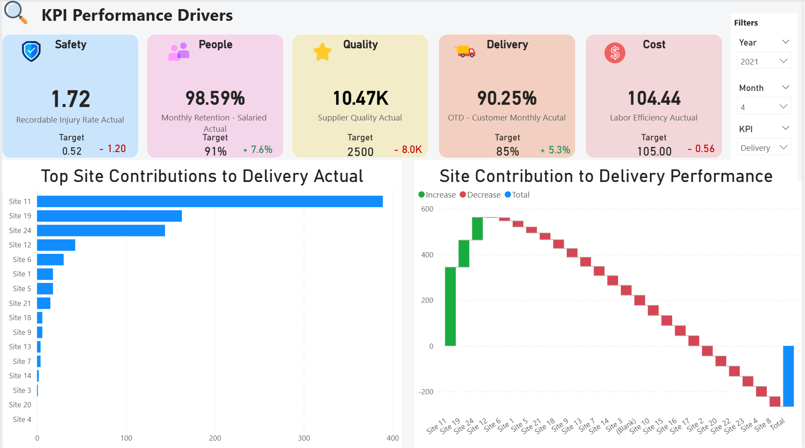
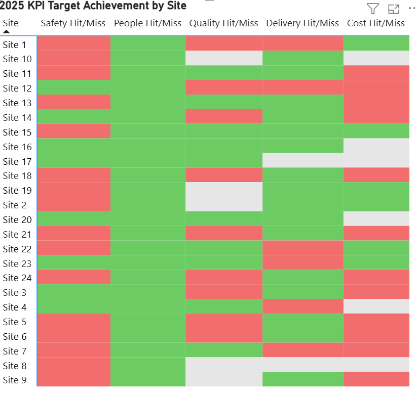
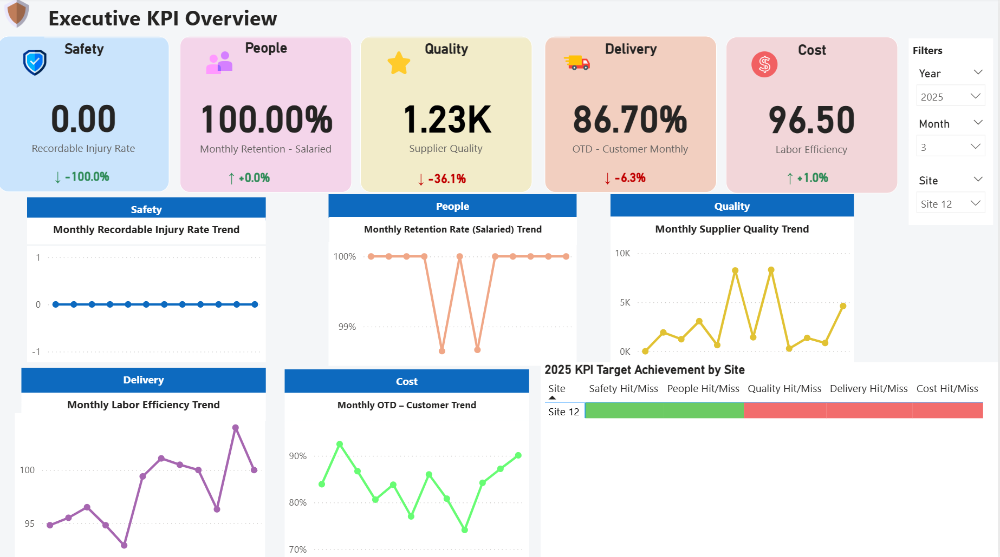
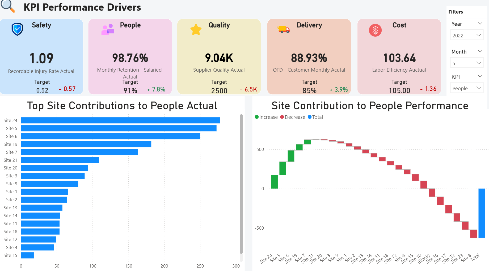

# 📊 Executive KPI Dashboard (Power BI)

## Overview

This project presents an **executive-facing KPI dashboard** built in **Power BI** to support operational performance monitoring across multiple sites and time periods.

The dashboard focuses on five core business domains:

- **Safety**
- **People**
- **Quality**
- **Delivery**
- **Cost**

The objective is to transform KPI tracking into a structured **decision-support system** that enables leadership teams to quickly identify performance gaps, evaluate site-level contributions, and monitor progress toward operational targets.

---

## Key Features

### 1. Executive KPI Overview

- High-level KPI scorecards with target comparison  
- Monthly trend visualization across operational domains  
- Site-level target achievement heatmap  
- Designed for fast executive scanning and exception detection  

---

### 2. KPI Performance Drivers

- KPI selection for focused analysis  
- Ranked site contribution comparison  
- Waterfall visualization showing performance impact  
- Supports operational root-cause discussions  

---

### 3. Interactive Exploration

The dashboard allows dynamic filtering by:

- Year  
- Month  
- Site  
- KPI Category  

This enables users to analyze both high-level performance patterns and detailed operational drivers.

---

## Evidence (Screenshots)

### Executive Overview  

### KPI Performance Drivers  

### KPI Target Achievement Heatmap  

### Interactive Filtering (Overview)  

### Interactive Filtering (Drivers)  

---

## Files Included

- **GD_OTDS.pbix** — Power BI dashboard source file  
- **screenshots/** — visual documentation of dashboard views  

---

## Business Value

This project demonstrates how operational KPI reporting can be transformed into an interactive decision-support dashboard by combining:

- Clear executive-level reporting design  
- Comparative site performance analysis  
- Target-driven monitoring workflows  
- Practical business usability  

The dashboard is structured to support leadership review meetings and ongoing operational performance tracking.

---

## Tech Stack

- **Power BI**
- **DAX (Calculated Measures & Logic)**
- **Data Modeling & KPI Structuring**

---

## Notes

Due to platform restrictions, the dashboard is presented through screenshots rather than a live embedded version.  
However, the `.pbix` file is included for full reproducibility and review.